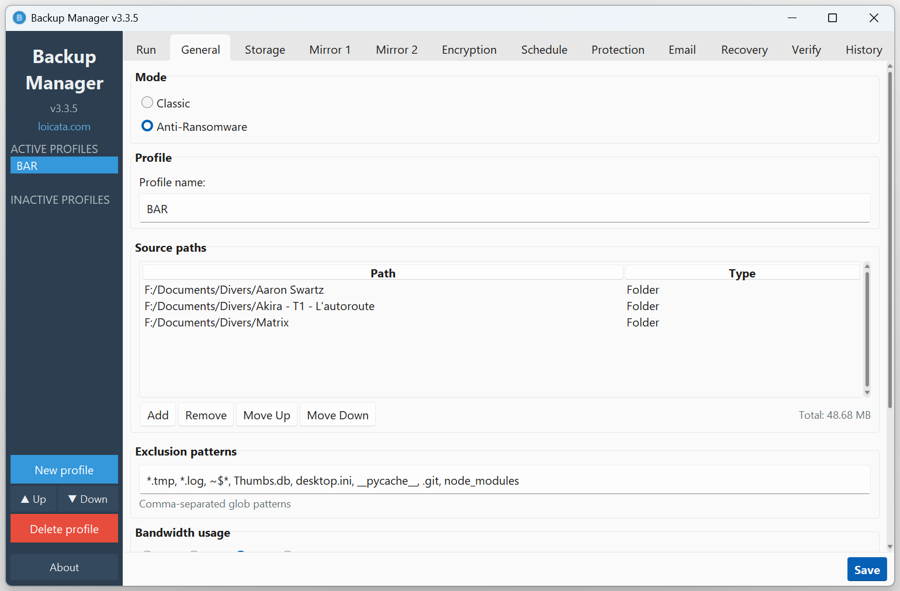
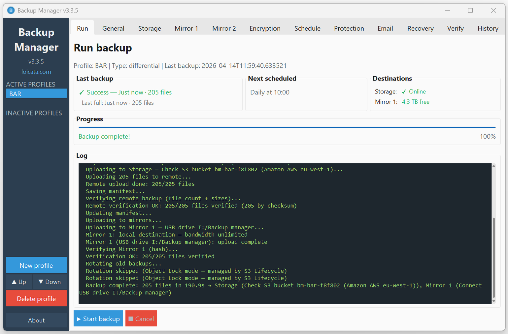

# Backup Manager v3.2.2

A production-grade, security-focused Windows backup application built for personal and small-business use. Backup Manager lets you manage multiple backup profiles, replicate data across local drives, network shares, SFTP servers, and S3-compatible cloud storage, while enforcing end-to-end encryption, automated scheduling, and Grandfather-Father-Son retention policies.

Built with a defense-in-depth approach: data is encrypted before it leaves memory, passwords never touch disk in plaintext, and every backup is cryptographically verified after writing.

---

## Screenshots

| Profile configuration | Backup in progress |
|:---------------------:|:------------------:|
|  |  |

---

## Key Features

### Multi-profile management

- Create unlimited backup profiles, each with its own sources, destinations, schedule, encryption, and retention settings.
- Profiles can be **active** (scheduled, run automatically) or **inactive** (paused, configuration preserved for later use).
- Reorder profiles with Up/Down controls; switch between them in a single click.
- Profile configuration is validated before every backup — errors navigate directly to the relevant tab with a clear explanation.

### Storage & Destinations

| Destination | Description |
|-------------|-------------|
| **Local / USB** | Any local drive, external HDD, or removable USB storage |
| **Network (UNC)** | Windows shared network folders (`\\server\share`) with username/password authentication |
| **SFTP (SSH)** | Remote servers via SSH with password or private key (Ed25519, ECDSA, RSA) authentication |
| **S3 Cloud** | Amazon S3 or S3-compatible providers: AWS, Scaleway, Wasabi, OVH, DigitalOcean Spaces, Cloudflare R2, Backblaze B2, MinIO |

### Mirrors (multi-destination replication)

- Up to **2 independent mirror copies** in addition to the primary destination.
- Each mirror can use a **different storage type** and **independent encryption settings** (e.g. primary on USB unencrypted, Mirror 1 on SFTP encrypted, Mirror 2 on S3 encrypted).
- Mirrors execute automatically after each successful primary write.
- Mirror failures are reported independently — the primary backup is never affected by a mirror error.
- GFS rotation is applied independently on each destination.

### Backup modes

| Mode | Description |
|------|-------------|
| **Full** | Complete copy of all selected files. Creates a self-contained restore point. |
| **Differential** | Only files changed since the last full backup. Uses SHA-256 manifest comparison for reliable change detection. Configurable full backup cycle (e.g. every N backups). |

### Retention (GFS rotation)

Grandfather-Father-Son rotation keeps backups organized and storage usage predictable:

- **Daily:** number of daily backups to keep beyond today.
- **Weekly:** number of weekly full backups to keep beyond the current week.
- **Monthly:** number of monthly full backups to keep beyond the current month.

Weekly and monthly slots require full backups — differential backups are only eligible for daily retention. Old backups are automatically deleted when the configured limits are exceeded. Rotation is applied independently on the primary destination and each mirror.

---

## Security Architecture

Backup Manager follows a **defense-in-depth** model with multiple independent security layers. The goal is simple: even if an attacker gains access to the backup storage, the data remains unreadable without the encryption password.

### Encryption at rest — `.tar.wbenc` streaming format

Backups are encrypted using a custom streaming archive format (`.tar.wbenc`) that ensures **no plaintext data is ever written to disk**:

```
.tar.wbenc file layout:

Header (37 bytes):
  [4B magic: "WBEC"]        — file format identifier
  [1B version: 0x01]        — format version
  [16B salt]                 — random salt for key derivation
  [16B reserved]             — future use (zeroed)

Body (repeating chunks):
  [4B plaintext_length]     — big-endian chunk size
  [12B nonce]                — sequential counter (never reused)
  [ciphertext + 16B GCM tag] — authenticated encrypted data

EOF sentinel:
  [4B zeros]                 — marks end of stream
```

**How it works:**
1. Source files are streamed into a tar archive in memory.
2. The tar stream is split into 1 MB chunks.
3. Each chunk is encrypted independently with AES-256-GCM before writing to disk.
4. The integrity manifest (`.wbverify`) is embedded inside the archive.
5. The original plaintext files are never written to the destination.

This design means an interrupted or corrupted write cannot leak plaintext data.

### Cipher and key derivation

| Parameter | Value | Rationale |
|-----------|-------|-----------|
| **Cipher** | AES-256-GCM | NIST-approved authenticated encryption. Provides both confidentiality and integrity in a single operation. |
| **Key size** | 256 bits | Maximum AES key length. |
| **Nonce** | 12 bytes, sequential counter | Unique per chunk. Counter mode prevents nonce reuse within a single archive. |
| **Authentication tag** | 16 bytes (128 bits) | GCM tag detects any tampering or corruption. |
| **Key derivation** | PBKDF2-HMAC-SHA256 | Industry-standard password-based KDF. |
| **Iterations** | 600,000 | Follows OWASP 2024 recommendation for PBKDF2-HMAC-SHA256. |
| **Salt** | 16 random bytes | Generated per archive using `os.urandom()`. Prevents rainbow table attacks. |

### Per-destination encryption control

Encryption is configured independently for each destination:

- **Primary storage** — encrypt or leave plaintext.
- **Mirror 1** — independent encryption flag and password.
- **Mirror 2** — independent encryption flag and password.

This allows flexible topologies, for example: unencrypted local backup for fast restores, encrypted SFTP mirror for offsite security, encrypted S3 mirror for cloud redundancy.

### Password storage and protection

Encryption passwords are stored using a layered protection scheme:

| Platform | Method | Details |
|----------|--------|---------|
| **Windows (primary)** | DPAPI (`CryptProtectData`) | Password encrypted and tied to the current Windows user account. Cannot be decrypted by another user or on another machine. |
| **Fallback** | AES-256-GCM with machine key | A random 32-byte machine key is generated once and stored in a DPAPI-protected blob at `%APPDATA%/BackupManager/machine.key`. |

**Password policy:**
- Minimum length: **16 characters** (enforced in the UI).
- Password strength indicator warns against weak passwords.
- Passwords are **never logged**, **never written to plaintext files**, and **never included in error messages**.

### Secure memory handling

- Encryption keys and passwords are held in `bytearray` buffers.
- Buffers are explicitly **zeroed after use** to minimize exposure in memory.
- Python's garbage collector cannot be fully controlled, but explicit zeroing reduces the window of exposure.

> **Limitation:** Memory clearing is best-effort and relies on CPython implementation details. On alternative interpreters (PyPy, GraalPy) or under memory pressure, sensitive data may remain in process memory after zeroing. This is an inherent constraint of managed-memory languages. For threat models requiring guaranteed memory erasure, a native-code encryption layer would be needed.

### Integrity verification pipeline

Every backup goes through a mandatory verification pipeline:

1. **Pre-backup manifest** — SHA-256 hash of every source file is computed before writing.
2. **Post-write verification** — after the backup is written, every file is re-read and re-hashed against the manifest.
3. **Remote verification** — for SFTP destinations, server-side `sha256sum` is used; for S3, ETag/MD5 comparison.
4. **GCM authentication** — for encrypted backups, the AES-256-GCM tag on each chunk provides additional tamper detection.
5. **Zero-tolerance policy** — any mismatch (missing file, wrong hash, failed GCM tag) marks the entire backup as **failed**.

The `.wbverify` manifest is embedded inside encrypted archives and stored alongside plaintext backups for future independent auditing.

### Transport security

| Transport | Protection |
|-----------|------------|
| **SFTP** | SSH encrypted channel. Host key verification (TOFU model). Password or private key authentication. |
| **S3** | HTTPS/TLS. AWS Signature V4 request signing. Access key + secret key authentication. |
| **Network (UNC)** | Windows SMB authentication. Credentials stored via DPAPI. |
| **Local** | No transport encryption needed (direct filesystem access). |

### Path traversal protection

All remote file paths are validated before use:
- Remote backup names cannot contain `..`, absolute paths, or path separator sequences.
- This prevents a compromised or malicious remote server from writing outside the designated backup directory.

### Summary

| Layer | Mechanism |
|-------|-----------|
| **Data at rest** | AES-256-GCM streaming encryption (`.tar.wbenc`) — no plaintext on disk |
| **Key derivation** | PBKDF2-HMAC-SHA256, 600,000 iterations, 16-byte random salt |
| **Password storage** | Windows DPAPI (user-bound) with AES-256-GCM fallback |
| **Integrity** | SHA-256 manifest + post-write verification + GCM authentication |
| **Transport** | SSH (SFTP), HTTPS/TLS (S3), SMB (Network) |
| **Memory** | Sensitive buffers explicitly zeroed after use |
| **Path safety** | Traversal-proof remote path validation |
| **Logging** | No secrets, passwords, or keys in any log output |

---

## Scheduling & Reliability

- **Manual, Hourly, Daily, Weekly, or Monthly** scheduling via Windows Task Scheduler.
- **Auto-start at logon** for fully unattended operation.
- **Retry on failure** with progressive delays: 2, 10, 30, 90, and 240 minutes.
- **Pre-backup target check:** all destinations (primary + mirrors) are verified before backup starts. Unreachable targets trigger a user prompt with options to connect or cancel.
- **System tray** mode for silent background operation.
- **Missed backup detection:** if a scheduled backup was missed (e.g. computer was off), it runs automatically on next startup.

---

## Recovery

- **Local restore** — browse a backup folder or select an encrypted `.tar.wbenc` file directly.
- **Remote retrieve** — download backups from SFTP or S3 destinations directly from the Recovery tab, no external tool required.
- **Automatic decryption** — encrypted archives are decrypted on-the-fly during restore using the profile password.
- **Clean output** — only user files are extracted; internal metadata (`.wbverify` manifest) is excluded from the restore.
- **Named restore folder** — restored files are placed in a subfolder named after the backup (e.g. `loicata_FULL_2026-04-01_215315/`).
- **Long path support** — Windows 260-character path limit is handled transparently via `\\?\` extended path prefix.

---

## Periodic Integrity Verification

- **On-demand verification** — click "Verify all backups" on the Verify tab to check all backups across all destinations (primary + mirrors).
- **Scheduled verification** — enable periodic verification in the Schedule tab (default: every 7 days). Runs automatically in the background.
- **Encrypted archives** — verified by comparing SHA-256 hash against the reference stored at backup time (no password needed).
- **Flat backups** — re-hashes every file against the `.wbverify` manifest.
- **Remote verification** — SFTP uses server-side `sha256sum`; S3 uses size comparison (S3 guarantees integrity at rest).
- **Real-time results** — each backup result appears immediately in the results table as verification progresses.
- **Email reports** — verification results are sent via email with a structured HTML table (Destination, Backup, Status, Details).

---

## Email notifications

- SMTP-based alerts on backup **success** or **failure**.
- Configurable recipient, subject, SMTP server, port, and TLS settings.
- HTML-formatted reports with backup details: file count, duration, destination, errors.
- Verification reports with structured HTML table matching the UI layout.
- Preset configurations for common providers (Gmail, Outlook, Yahoo).

---

## History

- Complete log of all backups with date, profile name, and file size.
- Quick access to the logs directory for detailed per-backup reports.

---

## Installation

### MSI Installer (recommended)

1. Download `BackupManager.msi` from the [Releases](https://github.com/loicata/backup-manager/releases) page.
2. Run the installer and follow the wizard.
3. Launch Backup Manager from the desktop shortcut or Start Menu.
4. The application launches automatically after installation.

### From Source

```bash
git clone https://github.com/loicata/backup-manager.git
cd backup-manager

pip install -r requirements.txt

python -m src
```

---

## Quick Start

### Setup Wizard (first run)

On first launch, a 3-step wizard guides you through the essential configuration:

1. **Profile name** — give your backup a meaningful name (e.g. "My Documents", "Work Projects").
2. **What to back up?** — add one or more source folders to include in the backup.
3. **Where to store?** — choose a primary storage destination:
   - External drive / USB stick
   - Network folder (UNC path)
   - Remote server via SFTP (SSH)
   - S3 Cloud Storage (AWS, Scaleway, Wasabi, OVH, DigitalOcean, Cloudflare, Backblaze)

Click **Finish** — the wizard creates your profile with a daily schedule enabled by default.

### Main interface

After the wizard, you land on the main interface with a modern Windows 11-style theme (Sun Valley). The configuration is organized in tabs:

| Tab | Description |
|-----|-------------|
| **Run** | Launch a backup manually, view real-time progress and detailed logs |
| **General** | Profile name, backup type (Full / Differential), source folders, exclusion patterns, bandwidth limit, full backup cycle |
| **Storage** | Primary storage destination type and connection settings |
| **Mirror 1** | First optional mirror destination (local, network, SFTP, or S3) |
| **Mirror 2** | Second optional mirror destination |
| **Encryption** | AES-256-GCM encryption toggle per destination (primary, mirror 1, mirror 2) with password management |
| **Schedule** | Backup frequency (manual, hourly, daily, weekly, monthly), time, auto-retry, and periodic integrity verification settings |
| **Retention** | GFS rotation policy — daily, weekly, and monthly backup counts |
| **Email** | SMTP notification settings with provider presets and test button |
| **Recovery** | Restore from local backup or retrieve from remote destination |
| **Verify** | On-demand integrity verification of all backups across all destinations with real-time results |
| **History** | Browse past backup logs with date, profile, and size |

Click **Start backup** on the Run tab to perform an immediate backup, or let the scheduler handle it automatically.

---

## Build from Source

### Prerequisites

- Python 3.11 or later (tested on 3.12 and 3.13)
- [WiX Toolset v3.14](https://wixtoolset.org/) (for MSI packaging only)

### Build the executable

```bash
python -m PyInstaller BackupManager.spec
```

The output is in `dist/BackupManager/`.

### Build the MSI installer

```bash
cd dist
heat.exe dir BackupManager -ag -sfrag -srd -dr INSTALLFOLDER -cg ProductFiles -var var.SourceDir -out HeatFiles.wxs
candle.exe -dSourceDir=BackupManager Product.wxs HeatFiles.wxs -o obj/
light.exe obj/Product.wixobj obj/HeatFiles.wixobj -o BackupManager.msi -ext WixUIExtension -b BackupManager -sice:ICE38 -sice:ICE91 -sice:ICE64
```

The output is `dist/BackupManager.msi`.

---

## Testing

```bash
# Run all tests
pytest

# Run with coverage report
pytest --cov=src --cov-report=term-missing

# Run a specific test file
pytest tests/unit/test_backup_engine.py -v
```

**Current status:** 799 tests | 84% coverage | 0 failures

CI pipeline: GitHub Actions on every push — Black formatting, Ruff linting (Ubuntu), full test suite with coverage enforcement (Windows, Python 3.12 + 3.13).

---

## Project Structure

```
backup-manager/
├── src/
│   ├── core/                     # Backup engine, scheduler, config, pipeline
│   │   ├── backup_engine.py         # Main orchestrator (11-phase pipeline)
│   │   ├── config.py                # Profile dataclasses & JSON persistence
│   │   ├── events.py                # Thread-safe event bus for UI updates
│   │   ├── hashing.py               # SHA-256 file hashing
│   │   ├── integrity_verifier.py    # Periodic backup integrity verification
│   │   ├── scheduler.py             # Windows Task Scheduler + in-app scheduler
│   │   └── phases/                  # Pipeline phases
│   │       ├── collector.py            # File collection & exclusion filtering
│   │       ├── filter.py               # Differential change detection
│   │       ├── manifest.py             # SHA-256 integrity manifest
│   │       ├── encryptor.py            # Streaming tar encryption
│   │       ├── writer.py               # Write dispatcher (local/remote)
│   │       ├── local_writer.py         # Local filesystem writer
│   │       ├── remote_writer.py        # SFTP/S3 streaming upload
│   │       ├── verifier.py             # Post-write integrity verification
│   │       ├── mirror.py               # Mirror replication orchestrator
│   │       └── rotator.py              # GFS retention rotation
│   ├── storage/                  # Storage backends
│   │   ├── base.py                  # Abstract backend + retry decorator
│   │   ├── local.py                 # Local / USB
│   │   ├── network.py               # UNC network shares
│   │   ├── sftp.py                  # SFTP via Paramiko (SSH key + password)
│   │   └── s3.py                    # S3 via Boto3 (multi-provider)
│   ├── security/                 # Security layer
│   │   ├── encryption.py           # AES-256-GCM streaming, DPAPI, key management
│   │   ├── secure_memory.py        # Secure buffer zeroing
│   │   └── integrity_check.py      # Standalone integrity verification
│   ├── notifications/            # Alerting
│   │   └── email_notifier.py       # SMTP with HTML reports
│   └── ui/                       # GUI (Tkinter + Sun Valley theme)
│       ├── app.py                   # Main window, sidebar, tab management
│       ├── wizard.py                # First-launch 3-step setup wizard
│       ├── theme.py                 # Sun Valley (sv_ttk) + custom overrides
│       ├── tray.py                  # System tray integration
│       └── tabs/                    # 11 configuration tabs
├── tests/
│   ├── unit/                     # Isolated unit tests
│   ├── integration/              # Multi-component pipeline tests
│   └── conftest.py               # Shared session fixtures
├── assets/                       # Icons, license, screenshots
├── requirements.txt              # Runtime dependencies
├── pyproject.toml                # Project metadata & tool config
├── BackupManager.spec            # PyInstaller production build
├── BackupManagerDebug.spec       # PyInstaller debug build
├── build_pyinstaller.py          # Build automation script
├── build_msi.py                  # WiX MSI builder script
└── CLAUDE.md                     # AI assistant directives
```

---

## Requirements

| Requirement | Version |
|-------------|---------|
| **OS** | Windows 10 / 11 |
| **Python** | 3.11+ (development only — end users install the MSI) |
| **cryptography** | >= 43.0.0 |
| **paramiko** | >= 3.0.0 |
| **boto3** | >= 1.35.0 |
| **Pillow** | >= 10.0.0 |
| **pystray** | >= 0.19.0 |
| **sv_ttk** | >= 2.6.0 |

---

## License

[GNU General Public License v3.0](LICENSE) — Copyright (c) 2026 Loic Ader loicata.com

---

## Contributing

Contributions are welcome. Please open an issue before submitting a pull request for any significant change.
