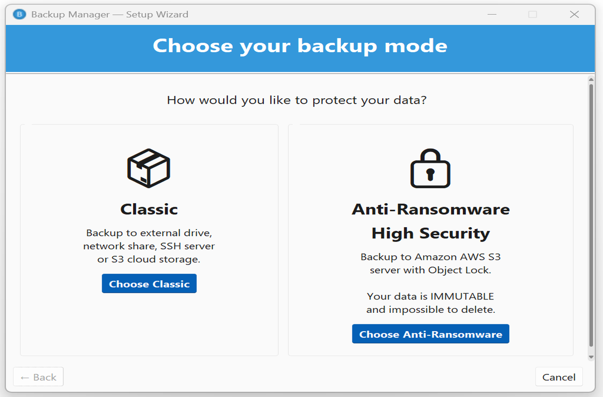
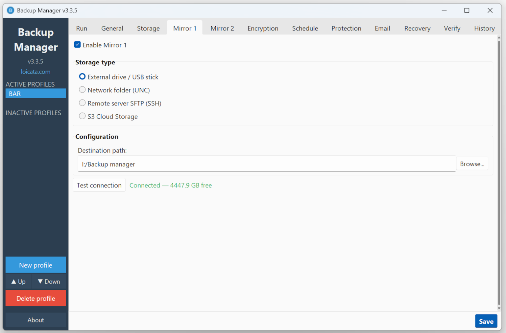

# Backup Manager v3

[](https://github.com/loicata/backup-manager/actions/workflows/ci.yml)
[](https://www.gnu.org/licenses/gpl-3.0)
[](https://www.python.org/downloads/)
[](#testing)
[](#testing)
[](https://github.com/loicata/backup-manager/releases)

A production-grade, security-focused Windows backup application with **anti-ransomware protection**. Designed for personal and small-business use, it combines multi-destination backups, end-to-end AES-256-GCM encryption, automated scheduling, and **Amazon AWS S3 Object Lock** to make your data truly indestructible.

---

## Two Modes, One Application

Backup Manager offers two distinct operating modes to match your security needs:

| Setup Wizard | Run Backup |
|:------------:|:----------:|
|  |  |
| **General Settings** | **Mirror Configuration** |
|  |  |

### Classic Mode

Traditional backup to external drives, network shares, SSH servers, or S3 cloud storage. Simple, fast, and flexible. Full and differential backups with GFS rotation.

### Anti-Ransomware Mode (High Security)

**Your data becomes IMMUTABLE and impossible to delete.**

Backups are stored on Amazon AWS S3 with **Object Lock Compliance** technology. Once uploaded, no one can delete or modify your data during the retention period you choose - not you, not a hacker, not even Amazon.

This is the same technology used by banks, hospitals, and governments to protect critical data against ransomware, insider threats, and human error.

---

## Why Anti-Ransomware Protection Matters

Traditional backups are vulnerable:

- **External drives** connected to your computer are encrypted by ransomware alongside your files
- **Network shares** accessible from your machine are compromised in the same attack
- **Sophisticated ransomware** stays dormant for months before activating, contaminating your backups before you detect the infection

**Backup Manager's Anti-Ransomware mode solves this** by making backups physically impossible to delete or modify for the duration you choose. Even if an attacker gains complete control of your computer and your Amazon AWS account, your data remains untouchable.

### How It Works

1. **Monthly full backups** — A complete copy of all your data, locked for the entire retention period plus 30 days
2. **Daily differential backups** — Only modified files, locked for 30 days
3. **Automatic cleanup** — Amazon AWS S3 Lifecycle rules remove expired backups automatically
4. **No manual intervention** — Backup Manager runs silently in the background

### Retention Options

| Duration | Use Case |
|----------|----------|
| **1 month** | Testing and evaluation |
| **4 months** | Protection against sophisticated ransomware (standard dwell time: 3 months) |
| **13 months** | Annual protection with margin |
| **7 years** | Regulatory compliance |
| **13 years** | Long-term archival |
| **Custom** | 2 to 20 years |

### Cost Transparency

The 11-step guided wizard includes a **detailed cost simulation** based on Amazon AWS S3 Glacier Instant Retrieval pricing. All costs are displayed upfront - no hidden fees, no surprises. Backup Manager provides no guarantee and cannot be held responsible for Amazon AWS costs.

---

## Key Features

| | Feature | Details |
|---|---------|---------|
| **S3 Object Lock** | **Anti-Ransomware** | Compliance mode - data is IMMUTABLE during retention period |
| **4** | **Storage backends** | Local/USB, Network (UNC), SFTP (SSH), S3-compatible cloud |
| **+2** | **Mirror copies** | Independent replication with per-destination encryption |
| **AES-256** | **Streaming encryption** | GCM authenticated, no plaintext on disk (`.tar.wbenc`) |
| **GFS** | **Retention rotation** | Grandfather-Father-Son (daily/weekly/monthly) |
| **SHA-256** | **Integrity verification** | Pre-backup manifest + post-write check + periodic audits |
| **DPAPI** | **Password protection** | Windows user-bound, never in plaintext |
| **Adaptive** | **Bandwidth management** | Auto-detect link speed, configurable throttling (25/50/75/100%) |

---

## Quick Start

### Install

Download **[BackupManager.msi](https://github.com/loicata/backup-manager/releases/latest)** and run it. That's it.

### First Launch

The setup wizard guides you through creating your first backup profile:

**Classic mode** (3 steps):
1. Name your backup
2. Pick source folders to protect
3. Choose a destination (USB, network, SFTP, or S3)

**Anti-Ransomware mode** (11 steps):
1. Understand the protection
2. Choose retention duration
3. Learn the backup strategy (monthly full + daily differential)
4. Review cost simulation
5. Read important information
6. Create your Amazon AWS account (guided step-by-step)
7. Name your backup
8. Pick source folders
9. Optional encryption
10. Optional local mirror
11. Automatic S3 bucket configuration with Object Lock

### From Source

```bash
git clone https://github.com/loicata/backup-manager.git
cd backup-manager
pip install -r requirements.txt
python -m src
```

---

## Features in Detail

### Multi-Profile Management

- Unlimited profiles with independent sources, destinations, schedule, encryption, and retention.
- **Classic / Anti-Ransomware mode selector** in the General tab - profiles are filtered by mode.
- **Active / Inactive** profiles - inactive profiles are paused but preserved.
- Reorder with Up/Down controls; switch in a single click.
- Configuration validated before every backup with clear error messages.

### Storage & Destinations

| Destination | Description |
|-------------|-------------|
| **Local / USB** | Any local drive, external HDD, or removable USB storage. Auto-detection by hardware serial for drive letter changes. |
| **Network (UNC)** | Windows shared folders (`\\server\share`) with username/password |
| **SFTP (SSH)** | Remote servers with password or private key (Ed25519, ECDSA, RSA). Fast tar streaming via exec channel. |
| **Amazon AWS S3** | With optional Object Lock for anti-ransomware protection |
| **S3-compatible** | Scaleway, Wasabi, OVH, DigitalOcean, Cloudflare R2, Backblaze B2, MinIO |

### Mirrors (Multi-Destination Replication)

- Up to **2 independent mirror copies** in addition to the primary destination.
- Each mirror can use a **different storage type** and **independent encryption settings**.
- In Anti-Ransomware mode, mirror failures are **warnings** (not errors) - the primary S3 backup is always safe.
- GFS rotation is applied independently on each destination.

### Backup Modes

| Mode | Description |
|------|-------------|
| **Full** | Complete copy of all selected files. Self-contained restore point. |
| **Differential** | Only files changed since last full backup. SHA-256 manifest comparison. Configurable full backup cycle. |

### Retention

**Classic mode:** Grandfather-Father-Son (GFS) rotation with configurable daily, weekly, and monthly counts. Rotation applied independently on each destination.

**Anti-Ransomware mode:** Amazon AWS Object Lock Compliance with S3 Lifecycle automatic cleanup. No rotation needed - data is physically locked until expiration.

### Scheduling & Reliability

- **Manual, Hourly, Daily, Weekly, or Monthly** scheduling.
- **Auto-start at logon** for unattended operation.
- **Retry on failure** with progressive delays: 2, 10, 30, 90, and 240 minutes.
- **Pre-backup target check** - all destinations verified before backup starts. Option to **continue without mirror** if primary storage is available.
- **System tray** mode for silent background operation.
- **Missed backup detection** - runs automatically on next startup.
- **Adaptive bandwidth test** - 16 MB probe for slow links, 128 MB full test for fast connections. Prevents network saturation on slow connections like Starlink.

### Recovery

- **Local restore** - browse a backup folder or select an encrypted `.tar.wbenc` file.
- **Remote retrieve** - download from SFTP or S3 directly from the Recovery tab.
- **Automatic decryption** - encrypted archives decrypted on-the-fly.
- **Long path support** - Windows 260-character limit handled transparently.

### Email Notifications

- SMTP alerts on backup **success** or **failure**.
- HTML-formatted reports with file count, duration, destination, errors.
- Provider presets for Gmail, Outlook, Yahoo.

### Main Interface

| Tab | Description |
|-----|-------------|
| **Run** | Launch backup, view real-time progress, bandwidth measurement, and detailed logs |
| **General** | Mode selector, profile name, backup type, source folders, exclusion patterns, bandwidth |
| **Storage** | Primary destination type and connection settings |
| **Mirror 1 / 2** | Optional mirror destinations with independent storage and encryption |
| **Encryption** | AES-256-GCM toggle per destination with password management |
| **Schedule** | Frequency, time, auto-retry, periodic verification |
| **Protection** | Object Lock status, retention duration, region, bucket (Anti-Ransomware mode) |
| **Retention** | GFS rotation policy - daily, weekly, monthly counts (Classic mode) |
| **Email** | SMTP settings with provider presets and test button |
| **Recovery** | Restore from local or retrieve from remote (SFTP, S3) |
| **Verify** | On-demand integrity verification with real-time results |
| **History** | Browse past backup logs |

---

## Security Architecture

Defense-in-depth model with multiple independent security layers.

### Anti-Ransomware Protection (Object Lock)

| Layer | Mechanism |
|-------|-----------|
| **Immutability** | S3 Object Lock Compliance - no deletion possible during retention |
| **Full backups** | Locked for retention period + 30 days (covers all dependent differentials) |
| **Differential backups** | Locked for retention period |
| **Cleanup** | S3 Lifecycle auto-deletes after lock expiration |
| **No app deletion** | Backup Manager never attempts to delete Object Lock data |

### Encryption at Rest - `.tar.wbenc` Streaming Format

No plaintext data is ever written to disk:

```
.tar.wbenc file layout:

Header (37 bytes):
  [4B magic: "WBEC"]        - file format identifier
  [1B version: 0x01]        - format version
  [16B salt]                 - random salt for key derivation
  [16B reserved]             - future use (zeroed)

Body (repeating chunks):
  [4B plaintext_length]     - big-endian chunk size
  [12B nonce]                - sequential counter (never reused)
  [ciphertext + 16B GCM tag] - authenticated encrypted data

EOF sentinel:
  [4B zeros]                 - marks end of stream
```

### Cipher and Key Derivation

| Parameter | Value | Rationale |
|-----------|-------|-----------|
| **Cipher** | AES-256-GCM | NIST-approved authenticated encryption |
| **Key size** | 256 bits | Maximum AES key length |
| **Nonce** | 12 bytes, sequential counter | Unique per chunk, prevents reuse |
| **Authentication tag** | 16 bytes (128 bits) | Detects tampering or corruption |
| **Key derivation** | PBKDF2-HMAC-SHA256 | Industry-standard password-based KDF |
| **Iterations** | 600,000 | OWASP 2024 recommendation |
| **Salt** | 16 random bytes | `os.urandom()`, prevents rainbow tables |

### Password Storage

| Platform | Method | Details |
|----------|--------|---------|
| **Windows** | DPAPI (`CryptProtectData`) | Tied to current Windows user account |
| **Fallback** | AES-256-GCM with machine key | DPAPI-protected 32-byte machine key |

### Security Summary

| Layer | Mechanism |
|-------|-----------|
| **Anti-ransomware** | S3 Object Lock Compliance (immutable backups) |
| **Data at rest** | AES-256-GCM streaming (`.tar.wbenc`) |
| **Key derivation** | PBKDF2-HMAC-SHA256, 600K iterations, random salt |
| **Password storage** | Windows DPAPI (user-bound) + AES-256-GCM fallback |
| **Integrity** | SHA-256 manifest + post-write verify + GCM auth |
| **Transport** | SSH / HTTPS / SMB |
| **Memory** | Explicit buffer zeroing |
| **Path safety** | Traversal-proof remote path validation |
| **Logging** | No secrets in any log output |
| **Bug reports** | Dual HMAC + Ed25519 signed diagnostics, injection-proof |
| **Build** | Nuitka native compilation (no extractable bytecode) |

---

## Testing

```bash
# Run all tests
pytest

# Run with coverage report
pytest --cov=src --cov-report=term-missing

# Run a specific test file
pytest tests/unit/test_hashing.py -v
```

**Current status:** 1144 tests | 83% coverage | 0 failures

CI pipeline: GitHub Actions on every push - Black formatting, Ruff linting (Ubuntu), full test suite with coverage enforcement (Windows, Python 3.12 + 3.13).

---

## Build from Source

### Prerequisites

- Python 3.11+ (tested on 3.12 and 3.13)
- [Nuitka](https://nuitka.net/) (Python to C compiler)
- MSVC Build Tools (C compiler for Nuitka)
- [WiX Toolset v3.14](https://wixtoolset.org/) (for MSI packaging only)

### Build the Executable

```bash
python build_nuitka.py
```

Output: `dist/BackupManager/BackupManager.exe` (native C binary via Nuitka)

### Build the MSI Installer

```bash
python build_msi.py
```

Output: `dist/BackupManager-x.y.z.msi`

---

## Project Structure

```
backup-manager/
├── src/
│   ├── core/                        # Backup engine, scheduler, config, pipeline
│   │   ├── backup_engine.py            # Main orchestrator (11-phase pipeline)
│   │   ├── config.py                   # Profile dataclasses & JSON persistence
│   │   ├── events.py                   # Thread-safe event bus for UI updates
│   │   ├── bandwidth_tester.py         # Adaptive bandwidth measurement
│   │   ├── integrity_verifier.py       # Periodic backup integrity verification
│   │   ├── scheduler.py                # In-app scheduler + auto-start
│   │   └── phases/                     # Pipeline phases
│   │       ├── collector.py               # File collection & exclusion filtering
│   │       ├── filter.py                  # Differential change detection
│   │       ├── encryptor.py               # Streaming tar encryption
│   │       ├── writer.py                  # Write dispatcher (local/remote)
│   │       ├── verifier.py                # Post-write integrity verification
│   │       ├── mirror.py                  # Mirror replication orchestrator
│   │       └── rotator.py                # GFS retention rotation
│   ├── storage/                     # Storage backends
│   │   ├── local.py                    # Local/USB with drive serial detection
│   │   ├── network.py                  # SMB/CIFS network shares
│   │   ├── sftp.py                     # SSH with fast tar streaming
│   │   ├── s3.py                       # S3 + Object Lock support
│   │   ├── s3_setup.py                 # Object Lock provisioning & cost simulation
│   │   └── base.py                     # Abstract backend + retry + throttling
│   ├── security/                    # Encryption, DPAPI, secure memory
│   ├── notifications/               # SMTP email with HTML reports
│   └── ui/                          # Tkinter GUI (Sun Valley theme)
│       ├── wizard.py                   # 11-step anti-ransomware setup wizard
│       ├── app.py                      # Main window with mode selector
│       └── tabs/                       # Tab implementations
│           ├── protection_tab.py          # Object Lock status (Anti-Ransomware)
│           └── ...                        # General, Storage, Mirror, etc.
├── tests/                           # 1144 tests (unit + integration)
├── CHANGELOG.md                     # Release history
├── requirements.txt                 # Runtime dependencies
└── pyproject.toml                   # Project metadata & tool config
```

---

## Requirements

| Requirement | Version |
|-------------|---------|
| **OS** | Windows 10 / 11 |
| **Python** | 3.11+ (development only - end users install the MSI) |
| **cryptography** | >= 43.0.0 |
| **paramiko** | >= 3.0.0 |
| **boto3** | >= 1.35.0 |
| **Pillow** | >= 10.0.0 |
| **pystray** | >= 0.19.0 |
| **sv_ttk** | >= 2.6.0 |

---

## License

[GNU General Public License v3.0](LICENSE) - Copyright (c) 2026 Loic Ader [loicata.com](https://loicata.com)

---

## Contributing

Contributions are welcome. Please open an issue before submitting a pull request for any significant change.
